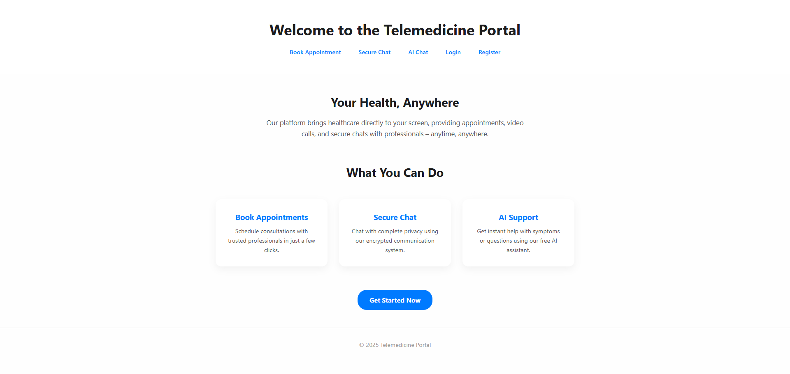
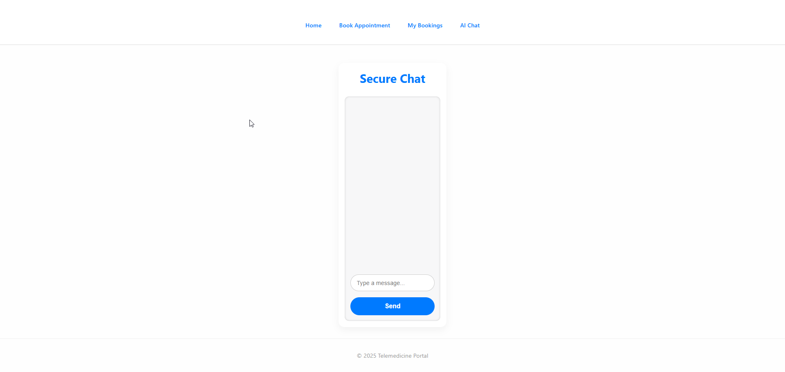
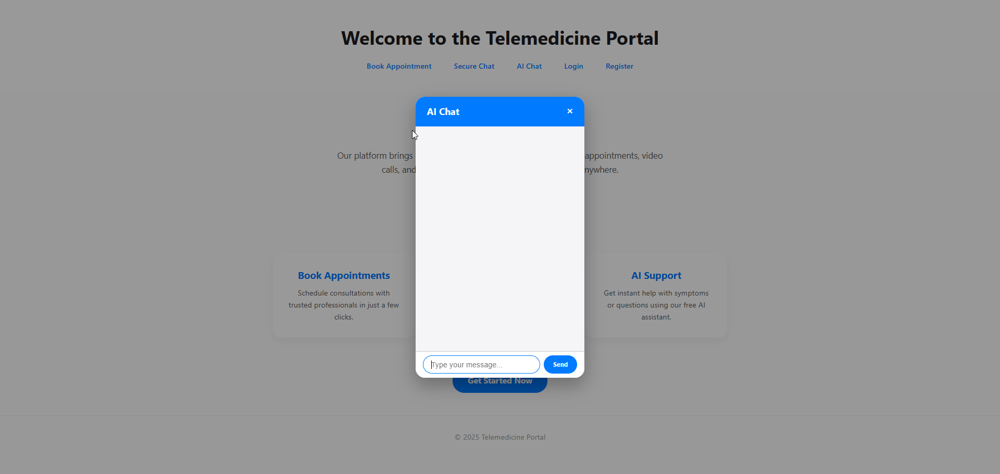
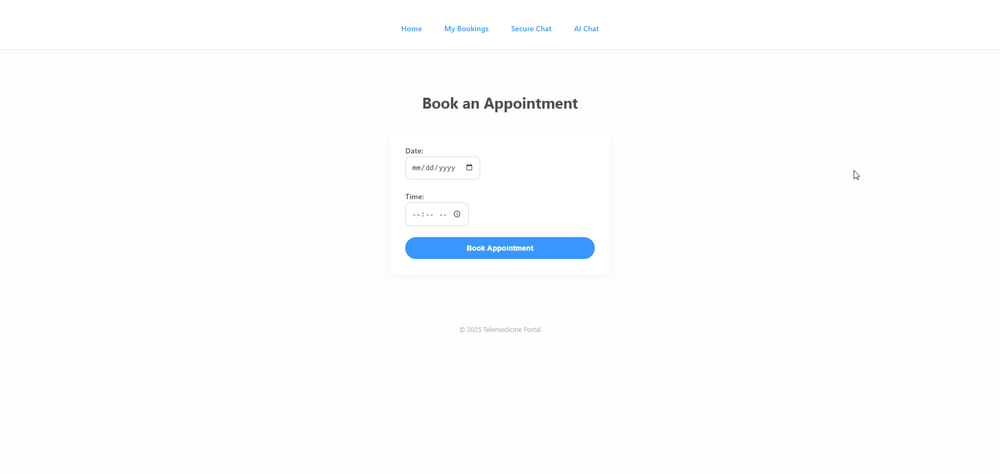

# Telemedicine Portal
[](https://github.com/achenio/telemedicine-portal)
[](https://github.com/achenio/telemedicine-portal/documentation/docs.md)

  

---

## Description

Telemedicine Portal is a secure and user-friendly web application that allows users to:

- Book medical appointments online  
- Chat securely with healthcare professionals via encrypted messaging  
- Use an AI assistant for instant support and symptom checks  

The platform ensures easy access to healthcare services from anywhere, with privacy and modern design.

---

## Features

- **Appointment Booking:** Schedule and manage consultations easily.  
- **Secure Chat:** Communicate with doctors and staff with end-to-end encryption.  
- **AI Support:** Get instant help with symptoms or questions via an AI chatbot.  
- **User Authentication:** Secure registration and login system with database storage.

---

## Live Demo & Links
WIP

---

## Screenshots

| Home Page              | Secure Chat            | AI Chat Popup          | Appointments          |
| ---------------------- | ---------------------- | ---------------------- | ---------------------- |
|  |  |  |  |

---

## Installation & Setup

1. Clone the repo  
   ```bash
   git clone https://github.com/achenio/telemedicine-portal.git
