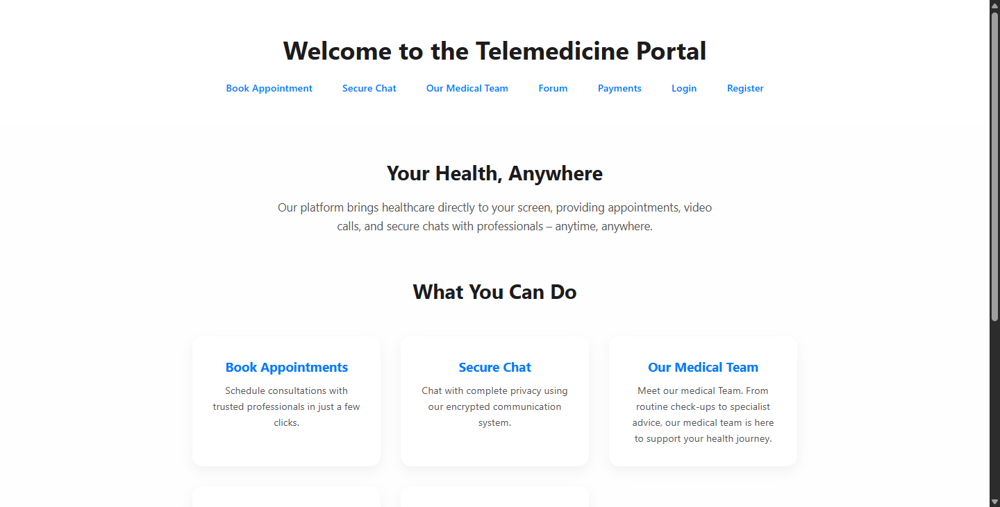
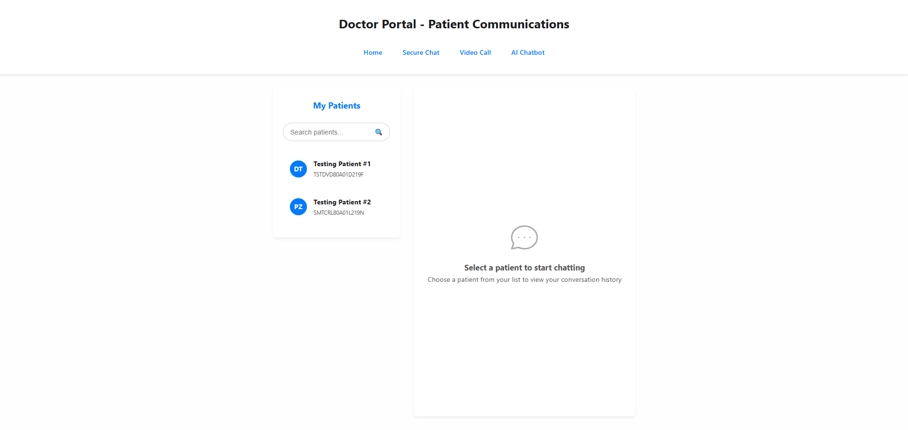
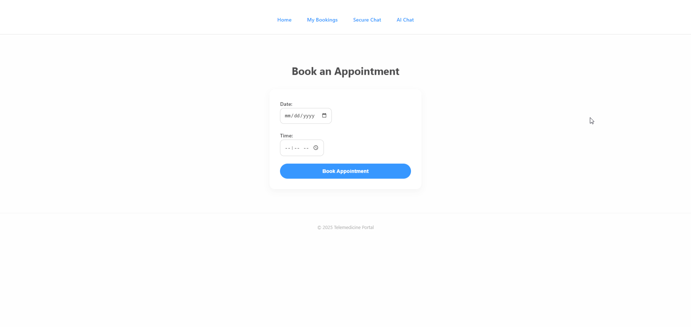
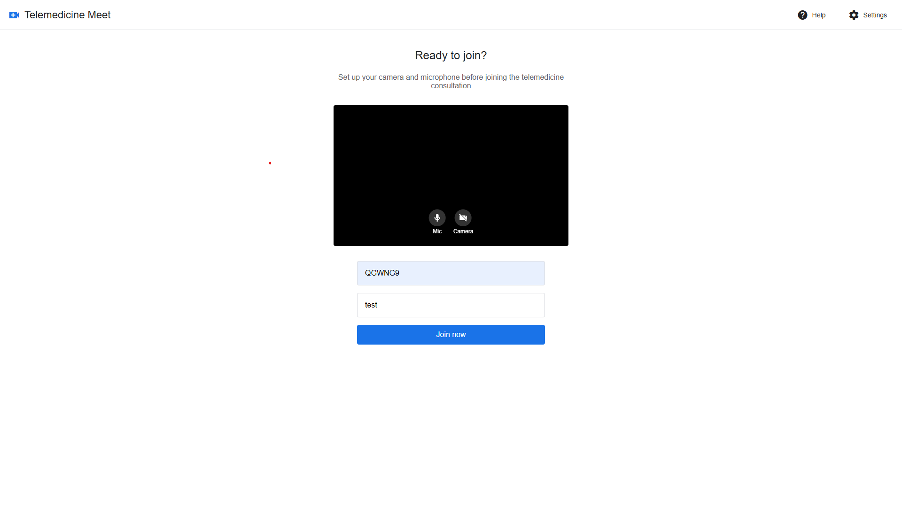
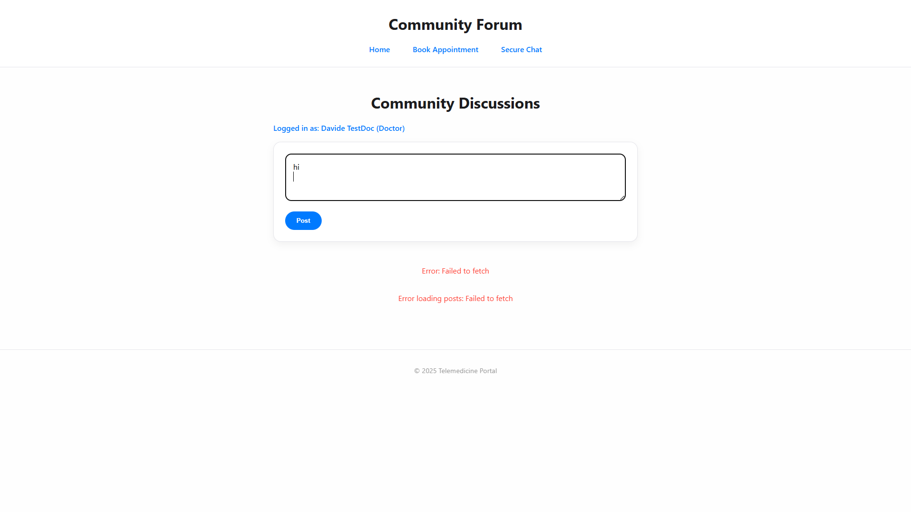
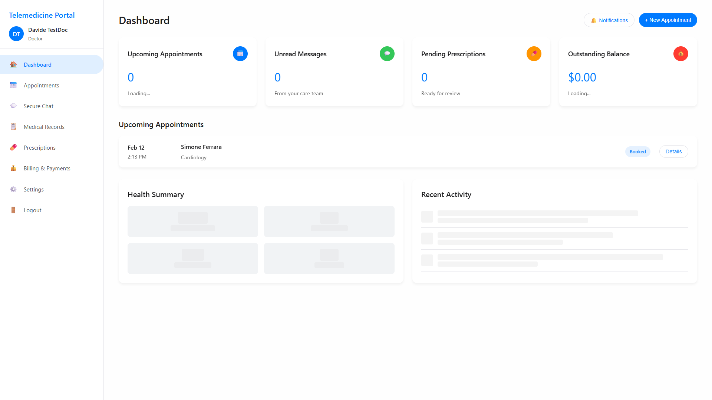

# Telemedicine Portal  
*By [Achenio Sogno](https://github.com/achenio), [Michele Portulano](https://github.com/MichyPortu08), and [Davide Albanese](https://github.com/DocCiaoBimbi)*

[](https://github.com/achenio/telemedicine-portal)
[](/documentation/docs.md)

---

## Description  
Telemedicine Portal is a secure and user-friendly web application that allows users to:  
- Book medical appointments online  
- Chat securely with healthcare professionals via encrypted messaging  

The platform ensures easy access to healthcare services from anywhere, with privacy and modern design.

---

## Features  
- *Appointment Booking:* Schedule and manage consultations easily.  
- *Secure Chat:* Communicate with doctors and staff with end-to-end encryption.  
- *User Authentication:* Secure registration and login system with database storage.

---

## Live Demo  
[View live Demo](https://telemedicine-portal-36gj.vercel.app/)

---

## Screenshots  

### Home Page
  

### Core Features  
| Patient View | Doctor View | Appointments |
|-------------|-------------|-------------|
|  |  |  |

### Additional Features  
| Video Consultation | Community Forum | User Dashboard |
|--------------------|----------------|----------------|
|  |  |  |

---

## Installation & Setup  
1. Clone the repo  
```bash
git clone https://github.com/achenio/telemedicine-portal.git